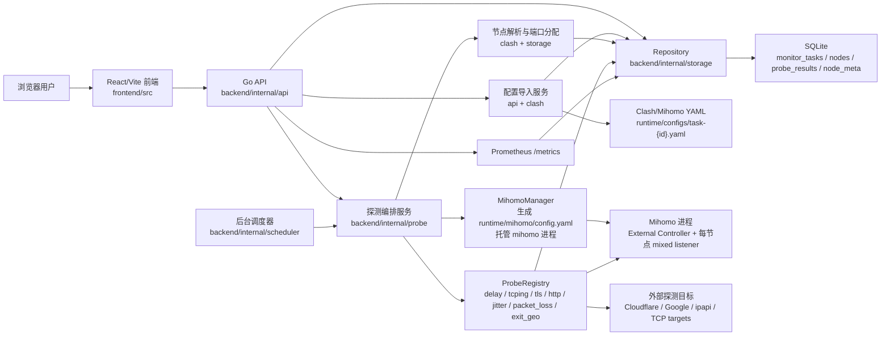

# Proxy Check 节点质量检测平台

基于 Clash/Mihomo 的代理节点质量检测平台。当前主线后端已切到 Go，
前端仍是 React/Vite。Mihomo 进程由后端托管，节点检测通过 Mihomo
External Controller 和每节点独立的 SOCKS5 listener 完成。

长期蓝图与路线图见 [AGENT.md](AGENT.md)。本文件覆盖当前已交付能力与本地运行方式。

## 项目架构



主要分层：

- **前端展示层**：`frontend/src/main.tsx` 和 `frontend/src/api.ts` 负责任务管理、节点列表、评分、画像和历史图表展示。
- **API 层**：`backend/internal/api` 注册 `/api` 路由、托管前端静态资源，并提供 `/metrics` 给 Prometheus 抓取。
- **任务与配置层**：Go API 下载并校验 Clash/Mihomo YAML，缓存到 `runtime/configs/task-{id}.yaml`，再同步任务节点。
- **探测执行层**：`backend/internal/scheduler` 定时触发到期任务；`backend/internal/probe` 串起 Mihomo 启动、并发探测和结果入库。
- **Mihomo 适配层**：Go `MihomoManager` 生成运行时配置，为每个节点写入独立 `mixed` listener，并通过 External Controller 获取 delay。
- **存储与观测层**：Go SQLite repository 写入 SQLite；API、前端和 Prometheus 指标都从同一批任务、节点、探测结果和节点画像数据读取。

## 已实现能力

- **多监测任务**：每个任务对应一个 Clash/Mihomo YAML URL，独立的检测周期与节点列表
- **节点级 listener**：每节点分配独立的 `mixed` 端口，避免在 Mihomo 全局 selector 上反复切换
- **探测维度**（默认全开，可在 `probe.dimensions` 关闭）
  - `delay`：调用 `/proxies/{name}/delay`
  - `tcping`：通过节点 listener 做 SOCKS5 TCP CONNECT
  - `tls_handshake`：通过节点 listener 测 TLS 握手耗时
  - `http_rtt`：通过节点 listener 请求 `https://www.gstatic.com/generate_204`
  - `jitter`：基于最近 20 条 `delay` 样本计算 stddev
  - `packet_loss`：连续 20 次 tcping 计算成功率
  - `exit_geo`：通过节点 listener 请求 `https://ipapi.co/json` 获取出口 IP / ASN / 国家 / 地区 / ISP
- **历史持久化**：SQLite，默认保留 30 天
- **节点评分**：API 与页面展示 0-100 分、置信度和分项贡献；评分只读计算，不落库
- **可观测性**：Prometheus 文本指标 `/metrics`，Grafana 示例见 `docs/grafana/proxy-check-v3.json`
- **可视化**：节点列表、状态徽章、评分排序、按 metric 分 tab 的折线图、节点画像卡片、按国家/ASN 过滤
- **部署**：Docker 多阶段构建 + docker-compose

当前版本只识别 Clash/Mihomo YAML 里的静态 `proxies`。
Base64 订阅、`proxy-providers` 展开、流媒体解锁、DNS 泄漏、带宽测速等
功能在路线图中，详见 [AGENT.md](AGENT.md)。

## 快速开始

```bash
export PATH="/usr/local/go/bin:$PATH"
export MIHOMO_SECRET="your_secret"
PROXY_CHECK_CONFIG=configs/config.yaml go run ./backend/cmd/proxy-check
```

启动后访问：

- 页面：`http://127.0.0.1:8000/`
- API：`http://127.0.0.1:8000/api`

Go 后端当前不内置 Swagger UI；API 以 README 中的接口表为准。

## 配置

```bash
cp configs/config.example.yaml configs/config.yaml
```

需要重点关注的字段：

| 字段 | 说明 |
|---|---|
| `mihomo.bin` | Mihomo 二进制路径，默认 `./runtime/bin/mihomo` |
| `mihomo.imported_config_dir` | 导入的配置 YAML 缓存目录，默认 `./runtime/configs` |
| `mihomo.listener_port_start` / `listener_port_max` | 节点 listener 的端口范围，默认 `20000-65000` |
| `mihomo.secret_env` | Mihomo external-controller secret 所在的环境变量名 |
| `probe.interval_seconds` | 任务级默认检测周期 |
| `probe.timeout_ms` | 单次探测超时 |
| `probe.import_timeout_ms` | URL 导入超时（默认 30 秒，与探测超时分开） |
| `probe.dimensions` | 启用的探测维度；MiaoSpeed 高级项为 `miaospeed_dns_leak`、`miaospeed_unlock`、`miaospeed_bandwidth` |
| `probe.tcp_targets` | tcping 与 packet_loss 的目标 |
| `miaospeed.enabled` | MiaoSpeed 高级探测开关，当前默认关闭 |
| `miaospeed.manage_sidecar` | 是否由 Go 后端托管 MiaoSpeed 进程，默认关闭；只有 `miaospeed.enabled` 同时为 true 时才会启动 |
| `miaospeed.bin` / `miaospeed.args` | 托管 sidecar 时使用的 MiaoSpeed 二进制和启动参数 |
| `miaospeed.work_dir` | MiaoSpeed sidecar 工作目录 |
| `miaospeed.ws_url` | MiaoSpeed sidecar WebSocket 地址 |
| `miaospeed.token_env` | MiaoSpeed server token 所在环境变量名 |
| `miaospeed.build_token_env` / `build_tokens` | MiaoSpeed Challenge 签名所需 build token；优先从环境变量读取，多个 token 用 `|` 分隔 |
| `miaospeed.start_timeout_ms` | 等待 sidecar WebSocket 就绪的超时时间 |
| `miaospeed.download_url` | 后续跑量/带宽测试使用的下载文件 URL |
| `miaospeed.max_bandwidth_concurrency` | 后续带宽测试最大并发，防止误跑高流量任务 |
| `miaospeed.dns_leak_script` | 通过 MiaoSpeed `TEST_SCRIPT` 执行的 DNS 泄漏检测脚本内容 |
| `miaospeed.dns_leak_script_path` | DNS 泄漏检测脚本文件路径；内联 `dns_leak_script` 非空时优先用内联内容 |
| `miaospeed.unlock_scripts` | 通过 MiaoSpeed `TEST_SCRIPT` 执行的解锁脚本，支持 `netflix/disney/openai/youtube` |
| `miaospeed.unlock_script_paths` | 解锁检测脚本文件路径 map；单个服务内联脚本非空时优先用内联内容 |

Mihomo controller secret 必须从环境变量读取，不进配置文件：

```bash
export MIHOMO_SECRET="your_secret"
```

## 下载 Mihomo

如果本机或镜像里没有 Mihomo 二进制，用脚本下载：

```bash
# 本地 macOS 测试
scripts/download_mihomo.sh --os darwin --arch arm64 --version v1.19.24

# 远端 Linux x86_64 / Docker amd64
scripts/download_mihomo.sh --os linux --arch amd64 --version v1.19.24

# Linux arm64
scripts/download_mihomo.sh --os linux --arch arm64 --version v1.19.24
```

不带 `--version` 时脚本跟随 GitHub latest release 跳转。下载文件落到 `runtime/bin/mihomo`，
`runtime/` 默认不入 Git，跨平台部署各自下载即可。
网络受限时可先打印 URL 或加 GitHub 代理前缀：

```bash
scripts/download_mihomo.sh --os linux --arch amd64 --version v1.19.24 --print-url
GITHUB_PROXY="https://your-github-proxy.example" \
  scripts/download_mihomo.sh --os linux --arch amd64 --version v1.19.24
DOWNLOAD_CONNECT_TIMEOUT=5 DOWNLOAD_MAX_TIME=30 \
  scripts/download_mihomo.sh --os linux --arch amd64 --version v1.19.24
```

## Docker 部署

镜像在构建期编译前端和 Go 后端。SQLite 数据库、Mihomo 二进制和导入的配置都通过宿主机目录挂载，
方便本地与远端使用不同平台的 Mihomo。

注意：容器跑的是 Linux 二进制，宿主机即使是 macOS，也不要把
macOS 版 Mihomo 挂进容器。

```bash
# 默认从 configs/clash.yaml 读取本地配置
export MIHOMO_SECRET="your_secret"
docker compose up -d --build
```

或自定义 host 端口：

```bash
APP_PORT=3456 docker compose up -d --build
```

容器内默认路径见 `configs/config.docker.yaml`：

- Mihomo：`/app/runtime/bin/mihomo`
- 本地 Clash 配置：`/app/configs/clash.yaml`
- 导入的任务配置：`/app/runtime/configs/task-{id}.yaml`
- SQLite：`/app/data/proxy_check.sqlite3`

日志与停止：

```bash
docker compose logs -f proxy-check
docker compose down
```

## 监测任务

页面左侧是任务列表，点"导入配置 URL"创建任务。任务级别的字段：

- `任务名称`：用于区分不同配置源
- `Clash 配置 URL`：必须 `http://` 或 `https://`，响应必须是 Clash/Mihomo YAML
- `检测间隔`：该任务自己的检测周期，最低 10 秒，默认 60 秒
- `高级探测`：控制 `miaospeed_*` 维度是否参与该任务检测，默认关闭

任务行为：

- 创建任务、编辑 URL、手动点"刷新配置"时才重新下载 URL；
  普通检测轮使用缓存的 YAML
- 同任务内按节点名去重；不同任务里的同名节点**互不合并**
- 每个任务独占一段 listener 端口，跨任务不冲突
- 删除任务会删除其所有节点和历史记录

## API

主要接口：

| Method | Path | 说明 |
|---|---|---|
| GET | `/api/tasks` | 任务列表，含节点数、最近运行状态 |
| POST | `/api/tasks` | 创建任务并导入 URL |
| PATCH | `/api/tasks/{id}` | 编辑任务字段；改 URL 会触发刷新 |
| DELETE | `/api/tasks/{id}` | 删除任务及其节点历史 |
| POST | `/api/tasks/{id}/refresh` | 重新下载 URL 并同步节点 |
| POST | `/api/tasks/{id}/run` | 立即检测单个任务 |
| GET | `/api/nodes` | 节点列表，可选 `?task_id=` |
| GET | `/api/nodes/{id}` | 节点详情，含最近错误 |
| GET | `/api/nodes/{id}/history` | 历史折线，参数 `metric` + `range=1h\|6h\|24h\|7d\|30d` |
| GET | `/api/stats` | 全局或单任务统计，可选 `?task_id=` |
| POST | `/api/tests/run` | 手动触发全部任务检测 |
| GET | `/metrics` | Prometheus 文本指标，可选 `?task_id=` |

节点列表与详情会额外返回：

- `score`：0-100 综合分；无数据时为 `null`
- `score_confidence`：参与评分的权重占比，0-1
- `score_breakdown`：`delay`、`packet_loss`、`jitter`、`transport`、`status`、
  `bandwidth`、`dns_leak`、`unlock` 分项（按已有数据动态出现）

默认基础评分权重：delay 35、packet_loss 25、jitter 15、tcp/http/tls transport 15、status 10。
高级探测可选分项：MiaoSpeed 带宽 10、DNS 泄漏 15、服务解锁 5；`score_confidence`
按已参与分项计算并封顶到 1.0。

## Prometheus / Grafana

Prometheus 抓取示例：

```yaml
scrape_configs:
  - job_name: proxy-check
    static_configs:
      - targets: ["127.0.0.1:8000"]
```

当前导出：

- `proxy_check_node_score`
- `proxy_check_node_score_confidence`
- `proxy_check_node_availability`
- `proxy_check_node_metric_latency_ms`
- `proxy_check_node_metric_value`

Grafana 可导入 `docs/grafana/proxy-check-v3.json` 作为起点，数据源选择 Prometheus。

## Go 后端状态

当前主线已经完成 Go 后端切换，Python/FastAPI 后端代码已移除。
Docker 与本地入口都使用 `backend/cmd/proxy-check`，仓库内不再保留 Python
后端、pytest 测试或 Python 下载辅助脚本。

已完成的 Go 后端能力：

- SQLite schema 初始化与兼容迁移，不引入 PostgreSQL
- 任务 URL 导入、刷新、编辑、删除
- 节点列表、详情、历史、统计、Prometheus `/metrics`
- 手动检测单任务和全量任务，后台按任务 `next_run_at` 调度
- Go-managed Mihomo subprocess，生成每节点 `mixed` listener
- `delay`、`tcping`、`tls_handshake`、`http_rtt`、`packet_loss`、`jitter`、`exit_geo`
- React 静态页面由 Go 后端托管
- 已修复 Go 上线前阻塞项：
  - Mihomo runtime config 内容或 listener 变化会触发重建/重启
  - Mihomo 子进程退出会被观察到并清理，后续检测可重新拉起
  - `/api/nodes/{id}/history` 对不存在节点返回 404
  - URL 刷新失败会写入 `last_refresh_error`
  - 创建任务中途失败会清理半成品任务
  - 默认拒绝 localhost、内网、link-local、multicast 等配置导入 URL
  - 配置 URL 下载会复查实际连接地址，降低 DNS rebinding 绕过风险

本地启动：

```bash
export PATH="/usr/local/go/bin:$PATH"
PROXY_CHECK_CONFIG=configs/config.yaml \
PROXY_CHECK_ADDR=:8000 \
go run ./backend/cmd/proxy-check
```

`PROXY_CHECK_GO_ADDR` 仍作为旧部署兼容变量保留；新部署建议统一使用
`PROXY_CHECK_ADDR`。

下一步已切到 Go 侧 MiaoSpeed：`backend/internal/miaospeed` 已提供
请求构造、Challenge 签名、WebSocket client 和按脚本 Key 的响应 frame 归一化；`backend/internal/probe`
已接入 `miaospeed_bandwidth`、`miaospeed_dns_leak` 和 `miaospeed_unlock`
prober；Go 主程序也可以按配置托管 MiaoSpeed sidecar 进程并等待 WebSocket
就绪；每个任务可单独开启或关闭高级探测。后续继续补真实 MiaoSpeed 集成验证。

## MiaoSpeed 集成状态

v4 开始接入 [MiaoMagic/miaospeed](https://github.com/MiaoMagic/miaospeed)。
当前代码已加入 MiaoSpeed WebSocket 请求/响应适配层、Challenge 签名、配置骨架和
`miaospeed_bandwidth`、`miaospeed_dns_leak`、`miaospeed_unlock` prober，
并支持 Go-managed sidecar 生命周期。节点详情页已能展示 DNS 泄漏、服务解锁和
带宽结果。默认不启用，也不随常规 60 秒探测自动跑。

### 下载 MiaoSpeed

如果需要本地或远端启用 MiaoSpeed sidecar，可下载官方 release 二进制到
`runtime/bin/miaospeed`：

```bash
# 本地 macOS arm64
scripts/download_miaospeed.sh --os darwin --arch arm64 --version v4.3.9

# 远端 Linux x86_64 / Docker amd64
scripts/download_miaospeed.sh --os linux --arch amd64 --version v4.3.9

# Linux arm64
scripts/download_miaospeed.sh --os linux --arch arm64 --version v4.3.9
```

不带 `--version` 时脚本跟随 GitHub latest release 跳转。下载文件落到
`runtime/bin/miaospeed`，压缩包缓存到 `runtime/downloads/`。Docker 容器内默认配置
读取 `/app/runtime/bin/miaospeed`，所以宿主机挂载 `runtime/` 后要下载 Linux 版本。
Docker 默认按 Go 托管 sidecar 设计，`miaospeed.ws_url` 使用容器内本机地址
`ws://127.0.0.1:8766`；如果改为独立 MiaoSpeed 容器，再把它改成对应服务名地址。
网络受限时可先打印 URL 或加 GitHub 代理前缀：

```bash
scripts/download_miaospeed.sh --os linux --arch amd64 --version v4.3.9 --print-url
GITHUB_PROXY="https://your-github-proxy.example" \
  scripts/download_miaospeed.sh --os linux --arch amd64 --version v4.3.9
DOWNLOAD_CONNECT_TIMEOUT=5 DOWNLOAD_MAX_TIME=30 \
  scripts/download_miaospeed.sh --os linux --arch amd64 --version v4.3.9
```

启用带宽探测需要同时满足：

- `miaospeed.enabled: true`
- `miaospeed.enabled` 关闭时，即使 `probe.dimensions` 里写了 `miaospeed_*`，
  后端也不会注册或运行 MiaoSpeed prober
- `miaospeed.download_url` 配置为受控下载测试文件
- `probe.dimensions` 中显式加入 `miaospeed_bandwidth`、`miaospeed_dns_leak`
  或 `miaospeed_unlock`
- 任务表单中开启"高级探测"；默认关闭，避免高流量/解锁类探测跟随普通轮询运行
- 使用外部 MiaoSpeed 时配置 `miaospeed.ws_url`；需要 Go 后端托管时同时设置
  `miaospeed.enabled: true`、`miaospeed.manage_sidecar: true` 和 `miaospeed.bin`。`miaospeed.args`
  为空时，Go 后端默认执行 `server`，并通过 `TOKEN` 和 `BIND`
  环境变量传入 `MIAOSPEED_TOKEN` 与 `miaospeed.ws_url` 的 host:port；
  如果你填写 `miaospeed.args`，后端会按自定义参数启动
- 配置 `MIAOSPEED_TOKEN`；如果使用的 MiaoSpeed 二进制带 build token，还需要配置
  `MIAOSPEED_BUILD_TOKENS`，多个 token 用 `|` 分隔
- DNS 泄漏和解锁检测走 MiaoSpeed 上游真实的 `TEST_SCRIPT` matrix：
  `dns_leak_script` / `dns_leak_script_path` 提供 DNS 脚本，
  `unlock_scripts` / `unlock_script_paths` 提供 `netflix/disney/openai/youtube`
  脚本；未配置脚本时不会发送假矩阵名

生产环境推荐把脚本放在 `runtime/miaospeed/scripts/`，再在配置中使用路径字段。
Docker 部署已挂载整个 `runtime/`，容器内可写成：

```yaml
miaospeed:
  dns_leak_script_path: /app/runtime/miaospeed/scripts/dns-leak.js
  unlock_script_paths:
    netflix: /app/runtime/miaospeed/scripts/netflix.js
    disney: /app/runtime/miaospeed/scripts/disney.js
    openai: /app/runtime/miaospeed/scripts/openai.js
    youtube: /app/runtime/miaospeed/scripts/youtube.js
```

当前已完成最小真实 sidecar 联调：用临时补齐 embed 资源后本机构建的
MiaoSpeed 4.3.9-Core 验证了 `TEST_PING_CONN`、`TEST_SCRIPT`、真实
`Vendor=Clash` HTTP 节点 payload，以及 `SPEED_AVERAGE` / `SPEED_MAX` /
`SPEED_PER_SECOND` 带宽矩阵。下一步需要换成发布二进制或正式构建产物，
继续验证生产 DNS/解锁脚本输出。

后续接入顺序：

- 使用正式 MiaoSpeed 二进制做生产 DNS/解锁脚本联调
- 根据矩阵输出继续细化 UI 状态解释和错误文案

已有 opt-in 集成测试入口，默认跳过。准备好可运行的 MiaoSpeed 二进制后可执行：

```bash
PROXY_CHECK_MIAOSPEED_INTEGRATION=1 \
MIAOSPEED_BIN=/path/to/miaospeed \
MIAOSPEED_TOKEN=your_token \
MIAOSPEED_BUILD_TOKENS='build-a|build-b' \
go test ./backend/internal/miaospeed -run TestMiaoSpeedSidecarIntegration
```

为了给 MiaoSpeed `Clash` vendor 构造真实节点 payload，平台会在导入节点时把
Clash 节点原始配置写入 SQLite 的 `nodes.raw_config`。这和缓存到
`runtime/configs/task-{id}.yaml` 的导入配置一样可能包含代理密钥，生产环境需要保护
`data/` 和 `runtime/configs/` 的文件权限。

MiaoSpeed 是 AGPLv3 项目。分发修改版二进制、嵌入源码或做深度派生前，
需要先完成许可证合规检查；首阶段优先按外部 sidecar/容器方式对接。

## 检测说明

- 默认每 60 秒一轮，由各任务的 `interval_seconds` 控制
- 单轮内并发数受 `probe.concurrency` 限制（默认 100）
- 默认 tcping 目标：`1.1.1.1:443/80`、`8.8.8.8:443/80`
- 历史记录默认保留 30 天，由 `probe.retention_days` 控制
- 每节点 listener 端口在 `[listener_port_start, listener_port_max]`
  内通过 gap-finding 分配；范围内可分配 ~45000 个槽位（同时跨所有任务）
- 日志默认使用 JSON 行格式，方便 Docker / 日志平台采集

## 前端开发

要求 Node.js 22.12+ 与 npm 10.9+。如果默认 Node 较低，建议用 nvm：

```bash
cd frontend
nvm install 22 && nvm use
npm install
npm run dev
```

构建：

```bash
cd frontend
npm run build
```

构建产物落到 `web/static/`，由 Go 后端直接托管。

## 测试

```bash
export PATH="/usr/local/go/bin:$PATH"
go test ./...

export PATH="/opt/homebrew/opt/node@22/bin:$PATH"
npm --prefix frontend run build
```

Docker 构建需要本机安装 Docker；本地没有 Docker 时以 Go 测试和前端构建为准。
